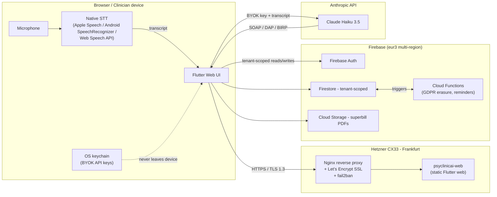
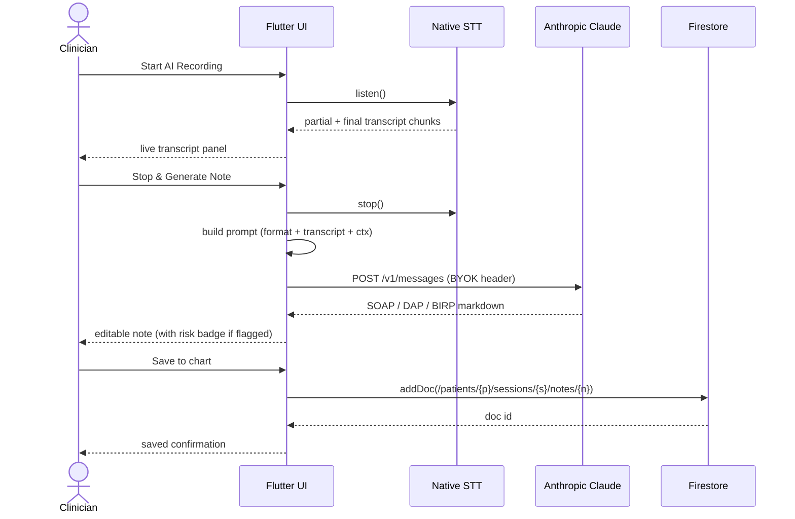
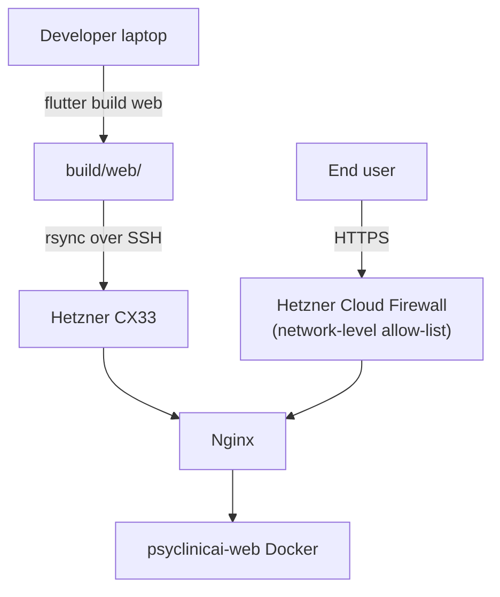

# Architecture

PsyClinicAI is a Flutter-first SaaS for mental-health practitioners with an
AI co-pilot at its core. This document explains the runtime topology, data
model, security boundaries, and the rationale behind major decisions.

For individual architecture decisions (and their tradeoffs) see
[`docs/adr/`](docs/adr/).

---

## 1. Runtime topology



**Key invariants**

- **Audio never leaves the device.** Speech-to-text runs on the OS / browser; the server never sees raw audio.
- **API keys never leave the device.** BYOK stored in `flutter_secure_storage` → OS keychain.
- **EU data residency by default.** Firestore `eur3`, Hetzner DE; aligns with GDPR Article 44.
- **Per-tenant isolation in Firestore.** Every write checks `clinicId == auth.uid` (pilot model: 1 user = 1 clinic).

---

## 2. Application layers (Flutter)

```
lib/
├─ main.dart                      # Router + global providers
├─ config/                        # Environment enum, feature flags
├─ services/
│  ├─ copilot/                    # AI ambient session co-pilot
│  │  ├─ api_key_storage.dart       (BYOK)
│  │  ├─ transcription_service.dart (on-device STT)
│  │  └─ soap_generator_service.dart (Anthropic Claude)
│  ├─ billing/                    # Insurance / superbill
│  │  ├─ cpt_lookup_service.dart
│  │  ├─ icd10_lookup_service.dart
│  │  └─ superbill_pdf_service.dart
│  ├─ assessments/                # Measurement-Based Care
│  │  ├─ phq9_service.dart
│  │  └─ gad7_service.dart
│  └─ data/                       # Firestore persistence (Sprint 3+)
│     ├─ firestore_schema.dart      (paths + constants)
│     ├─ auth_service.dart          (FirebaseAuth wrap)
│     ├─ patient_repository.dart
│     ├─ session_repository.dart
│     ├─ assessment_repository.dart
│     └─ superbill_repository.dart
├─ widgets/
│  ├─ copilot/                    # Live AI panel (5-state machine)
│  └─ design_system/              # Theme tokens, reusable components (Sprint 4)
└─ screens/
   ├─ landing/                    # Public marketing + pricing
   ├─ auth/                       # Login / signup
   ├─ dashboard/                  # Role-aware home
   ├─ session/                    # Live session + AI co-pilot
   ├─ billing/                    # Superbill builder
   ├─ assessments/                # PHQ-9 / GAD-7 runner
   ├─ patients/                   # Patient CRUD (Sprint 4)
   ├─ outcomes/                   # Trend dashboards (Sprint 4)
   ├─ settings/                   # API keys, profile, region
   └─ legal/                      # Privacy / ToS (Sprint 5)
```

### State management

Currently `Provider` + `ChangeNotifier`. Riverpod migration planned Sprint 5
once the data layer settles (see [ADR-0006](docs/adr/0006-state-management.md)).

### Routing

Named routes in `main.dart`. Deep linking planned Sprint 6.

---

## 3. Data model

```
Firestore (eur3)
└─ clinics/
   └─ {clinicId}                  # = ownerUserId in pilot solo model
      ├─ ownerId
      ├─ name
      ├─ clinicians/
      │  └─ {userId}
      │     ├─ email, fullName, role, credentials, npi, taxId
      └─ patients/
         └─ {patientId}
            ├─ fullName, email, phone, dob, memberId, insurer, address...
            ├─ sessions/
            │  └─ {sessionId}
            │     ├─ clinicianId, startedAt, endedAt, durationMinutes
            │     └─ notes/
            │        └─ {noteId}
            │           ├─ format                  # soap | dap | birp
            │           ├─ markdown                # full clinician-reviewed note
            │           ├─ transcript              # raw on-device ASR (optional)
            │           ├─ flaggedRisk, generatedByAi
            ├─ assessments/
            │  └─ {assessmentId}
            │     ├─ type                          # phq9 | gad7
            │     ├─ answers (int[]), score, severity, selfHarmFlag
            │     └─ completedAt
            └─ superbills/
               └─ {invoiceId}
                  ├─ invoiceNumber, serviceDate
                  ├─ totalCharges, amountPaid, balanceDue, status
                  ├─ diagnoses: [{code, label}]
                  ├─ serviceLines: [{date, cptCode, units, totalCharge}]
                  └─ pdfUrl
```

Source of truth: [`lib/services/data/firestore_schema.dart`](lib/services/data/firestore_schema.dart).

### Security rules (sketch)

```js
match /clinics/{clinicId} {
  allow read, write: if request.auth.uid == clinicId;

  match /{document=**} {
    allow read, write: if request.auth.uid == clinicId;
  }
}
```

Full ruleset in `firestore.rules` (Sprint 3).

---

## 4. AI co-pilot data flow



**Cost envelope per session** (Haiku 3.5, May 2026):

| Item | Tokens / units | Cost |
|------|----------------|------|
| 5-min transcript input | ~2,000 in | ~$0.0006 |
| SOAP note output | ~500 out | ~$0.0006 |
| **Total** | | **~$0.001 / session** |

100 sessions / month → ~$0.10. With BYOK the clinician absorbs this; PsyClinicAI is not in the per-token billing path.

---

## 5. Deployment



- Source of truth: [`deploy/deploy-hetzner.sh`](deploy/deploy-hetzner.sh).
- Production: `psyclinicai.com` → Hetzner Frankfurt, single CX33.
- Multi-tenant container layout — same host runs `kumarbazlar-app`, `ilhanostranscript`, `tradeflow_bot`. See [`deploy/`](deploy/).
- Backups: weekly Hetzner snapshot + Firestore export to Cloud Storage (Sprint 5).

---

## 6. Observability (Sprint 5)

- **Sentry** — Flutter SDK, breadcrumbs + replay; PII scrubbed.
- **PostHog** — funnel tracking (signup → first session → first save → first paid).
- **Structured logging** — `lib/services/observability/logger.dart` wraps `dart:developer.log`; `print()` is banned.
- **Status page** — UptimeRobot pinging `/healthz`.

---

## 7. Threat model (high level)

| Threat | Mitigation |
|--------|------------|
| Stolen BYOK API key | Stored in OS keychain only; never on server; user can rotate. |
| Compromised clinician device | Firebase short-lived tokens; re-auth required for sensitive actions (Sprint 5). |
| Insider access | Firestore tenant rules enforce `auth.uid == clinicId`; no admin SDK on web. |
| Audio leak | Audio never crosses the network. STT runs on device. |
| Transcript leak (to Anthropic) | Clinician must sign BAA + acknowledge AI vendor exposure during onboarding (Sprint 5). |
| SQL / NoSQL injection | Firestore is schemaless + typed via repositories; no string concat in queries. |
| XSS | Flutter web renders via framework primitives, not raw HTML. |
| Cross-tenant data leak | Single-rule enforcement at `/clinics/{clinicId}/**`. |

Full threat model: [SECURITY.md](SECURITY.md).

---

## 8. Quality gates

| Gate | Where |
|------|-------|
| Static analysis | `flutter analyze` + [`analysis_options.yaml`](analysis_options.yaml) (strict-casts, strict-inference, strict-raw-types) |
| Unit tests | `test/services/`, `test/widgets/` (target ≥ 60% coverage Sprint 4) |
| Integration tests | `integration_test/` (happy-path E2E) |
| Build verification | `flutter build web` succeeds with `--no-tree-shake-icons` |
| CI | [`.github/workflows/ci.yml`](.github/workflows/ci.yml) — analyze + test + build on every push |

---

## 9. Roadmap

| Sprint | Focus | Status |
|--------|-------|:------:|
| 0 | AI ambient co-pilot (transcription + SOAP) | DONE |
| 1 | Superbill (CPT + ICD-10 + PDF) | DONE |
| 2 | Measurement-Based Care (PHQ-9 / GAD-7) | DONE |
| **3** | **Backend: Firebase Auth + Firestore + repositories** | **in progress** |
| 4 | Frontend polish (patient CRUD, outcome dashboard) | next |
| 5 | Compliance + observability (BAA / DPA, Sentry, PostHog) | next |
| 6 | GTM (Stripe / Paddle, onboarding, mobile, DE/FR i18n) | next |
| 7+ | Legacy orphan code cleanup, Riverpod migration, native mobile launch | backlog |
